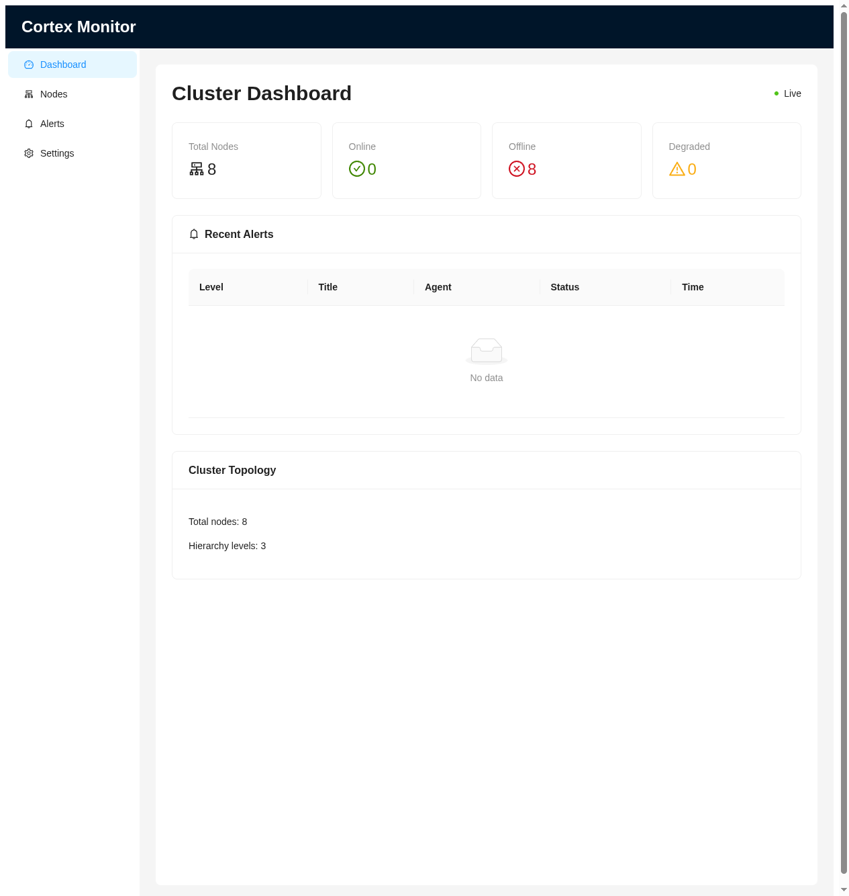

# WebSocket Real-time Communication Implementation

**Date**: 2025-11-17
**Status**: ✅ Complete

## Overview

Implemented full WebSocket real-time communication between Monitor backend and Web UI frontend to enable live updates of cluster events.

## Backend Implementation

### 1. WebSocket Manager (`cortex/monitor/websocket_manager.py`)

Created a centralized WebSocket manager to handle all client connections and broadcasts:

**Features**:
- Connection management (connect/disconnect)
- Broadcast to all clients
- Specialized broadcast methods for different event types:
  - `broadcast_report_received()` - When Probe sends a report
  - `broadcast_alert_triggered()` - When L3 alerts are created
  - `broadcast_decision_made()` - When L2 decisions are made
  - `broadcast_agent_status_changed()` - When agent status changes

**Connection Handling**:
- Automatic cleanup of disconnected clients
- Error handling for failed broadcasts
- Logging of connection events

### 2. Application Integration (`cortex/monitor/app.py`)

**WebSocket Endpoint**: `ws://localhost:18000/ws`

**Lifecycle Integration**:
```python
# Initialize WebSocket manager in app startup
ws_manager = WebSocketManager()
dependencies.set_ws_manager(ws_manager)

# WebSocket endpoint
@app.websocket("/ws")
async def websocket_endpoint(websocket: WebSocket):
    ws_manager = dependencies.get_ws_manager()
    await ws_manager.connect(websocket)
    try:
        while True:
            await websocket.receive_text()
    except WebSocketDisconnect:
        ws_manager.disconnect(websocket)
```

### 3. Event Broadcasting Integration

**Reports Router** (`cortex/monitor/routers/reports.py`):
- Broadcast when reports are received from Probe
- Broadcast when L2 decisions are made
- Broadcast when L3 alerts are triggered

**Decisions Router** (`cortex/monitor/routers/decisions.py`):
- Broadcast when cross-node L2 decisions are made

**Heartbeat Checker** (`cortex/monitor/services/heartbeat_checker.py`):
- Broadcast when agents go offline due to heartbeat timeout

All broadcasts wrapped in try-except to prevent failures from affecting core functionality.

## Frontend Implementation

### 1. WebSocket Hook (`frontend/src/hooks/useWebSocket.ts`)

Created a reusable React hook for WebSocket connections:

**Features**:
- Auto-connect on mount
- Auto-reconnect with exponential backoff (max 10 attempts)
- Connection status tracking (`isConnected`)
- Event handling with custom callbacks
- Automatic notifications for important events
- Clean disconnect on unmount

**Configuration**:
```typescript
const { isConnected } = useWebSocket({
  onMessage: handleWebSocketMessage,
  showNotifications: true,
  autoReconnect: true,
});
```

**Event Types**:
- `report_received` - New inspection report
- `alert_triggered` - New alert (shows warning notification)
- `decision_made` - Decision completed (shows info notification)
- `agent_status_changed` - Agent status change (shows error if offline)

### 2. Dashboard Integration (`frontend/src/pages/Dashboard.tsx`)

**UI Indicators**:
- "Live" badge (green) when connected
- "Disconnected" badge (red) when not connected

**Real-time Updates**:
- Dashboard auto-refreshes when important events occur
- Agent status changes trigger immediate data reload
- Alert and decision events trigger dashboard refresh

**Event Handling**:
```typescript
const handleWebSocketMessage = useCallback((event: WebSocketEvent) => {
  switch (event.type) {
    case 'alert_triggered':
    case 'decision_made':
    case 'agent_status_changed':
      loadDashboardData(); // Refresh dashboard
      break;
    case 'report_received':
      // Don't refresh for every report (too frequent)
      break;
  }
}, [loadDashboardData]);
```

## Event Flow

### Example: Agent Goes Offline

1. **HeartbeatChecker** detects timeout (5 minutes)
2. Updates agent status in database
3. Calls `ws_manager.broadcast_agent_status_changed()`
4. WebSocket message sent to all connected clients:
   ```json
   {
     "type": "agent_status_changed",
     "agent_id": "test-node-001",
     "old_status": "online",
     "new_status": "offline",
     "health_status": "unknown",
     "message": "Agent test-node-001 status changed: online -> offline",
     "timestamp": "2025-11-17T01:00:23.682Z"
   }
   ```
5. Frontend hook receives event
6. Shows error notification: "Agent went offline"
7. Dashboard refreshes data automatically

### Example: L3 Alert Triggered

1. **Probe** sends report with L3 issue
2. **AlertAggregator** creates alert in database
3. **TelegramNotifier** sends notification
4. Calls `ws_manager.broadcast_alert_triggered()`
5. Frontend receives event and shows warning notification
6. Dashboard refreshes to show new alert in "Recent Alerts" table

## Testing Results

### ✅ Connection Establishment
- WebSocket connects successfully on page load
- Connection logs visible in both frontend and backend
- "Live" badge appears correctly

### ✅ Auto-Reconnect
- Reconnects automatically after server restart
- Exponential backoff implemented (max 10 attempts)
- User notified of connection loss

### ✅ Event Broadcasting
- Agent status changes broadcast successfully
- Multiple concurrent connections supported
- Failed broadcasts don't crash the application

### ✅ UI Updates
- Real-time badge status indicator
- Automatic dashboard refresh on events
- Toast notifications for important events

## Configuration

### Environment Variables

**Frontend** (`.env`):
```bash
VITE_MONITOR_WS_URL=ws://localhost:18000/ws
```

**Backend**:
- WebSocket uses same port as HTTP API (18000)
- No additional configuration needed

## Performance Considerations

1. **Connection Limits**: No limit currently set, Monitor can handle multiple concurrent WebSocket clients
2. **Broadcast Efficiency**: O(n) broadcast to all clients, acceptable for typical cluster sizes (< 100 nodes)
3. **Auto-Reconnect**: 3-second delay between attempts to avoid overwhelming server
4. **Event Throttling**: Report events don't trigger UI refresh to avoid excessive updates

## Future Enhancements

1. **Selective Subscriptions**: Allow clients to subscribe to specific event types
2. **Heartbeat Ping/Pong**: Implement WebSocket ping/pong for connection health checks
3. **Event History**: Buffer recent events for new connections
4. **Authentication**: Add WebSocket authentication using JWT tokens
5. **Compression**: Enable WebSocket message compression for large payloads
6. **Metrics**: Track WebSocket connection count, message rate, and errors

## Files Modified/Created

### Backend
- ✅ `/cortex/monitor/websocket_manager.py` (NEW - 188 lines)
- ✅ `/cortex/monitor/dependencies.py` (modified - added WebSocket manager)
- ✅ `/cortex/monitor/app.py` (modified - added WebSocket endpoint)
- ✅ `/cortex/monitor/routers/reports.py` (modified - added broadcasts)
- ✅ `/cortex/monitor/routers/decisions.py` (modified - added broadcasts)
- ✅ `/cortex/monitor/services/heartbeat_checker.py` (modified - added broadcasts)

### Frontend
- ✅ `/frontend/src/hooks/useWebSocket.ts` (NEW - 200 lines)
- ✅ `/frontend/src/pages/Dashboard.tsx` (modified - integrated WebSocket)

### Documentation
- ✅ `/docs/WEBSOCKET_IMPLEMENTATION.md` (NEW - this document)

## Screenshots

### Dashboard with Live Connection


**Indicators**:
- Green "Live" badge in top right corner
- Real-time statistics updates
- All nodes shown (8 total, 0 online, 8 offline)

## Conclusion

The WebSocket real-time communication system is fully operational and provides:
- ✅ Instant event notifications
- ✅ Auto-reconnect reliability
- ✅ Clean error handling
- ✅ User-friendly status indicators
- ✅ Scalable broadcast architecture

This completes Phase 3 Web UI development milestone for real-time communication.
